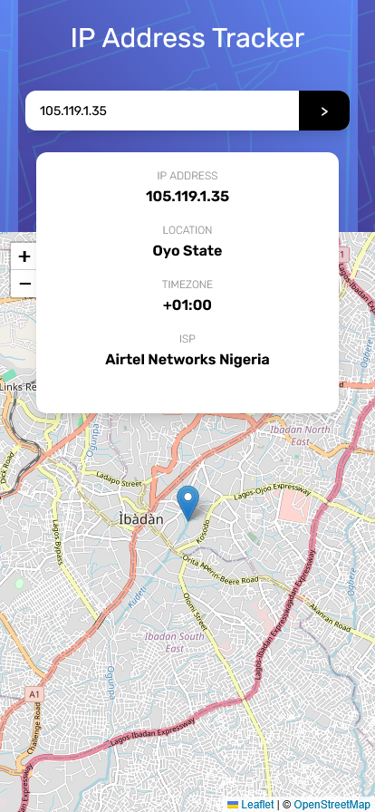
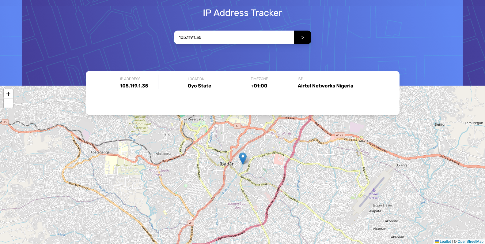
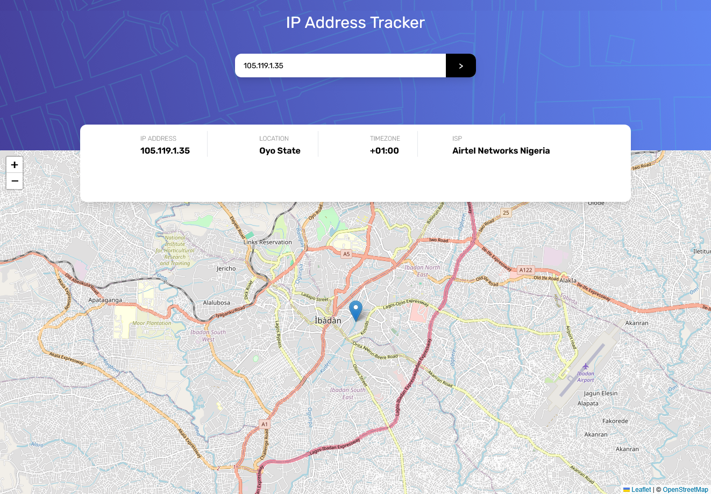

# Frontend Mentor - IP address tracker solution

This is a solution to the [IP address tracker challenge on Frontend Mentor](https://www.frontendmentor.io/challenges/ip-address-tracker-I8-0yYAH0). Frontend Mentor challenges help you improve your coding skills by building realistic projects. 

## Table of contents

- [Overview](#overview)
  - [The challenge](#the-challenge)
  - [Screenshot](#screenshot)
  - [Links](#links)
- [My process](#my-process)
  - [Built with](#built-with)
  - [What I learned](#what-i-learned)
  - [Continued development](#continued-development)
  - [Useful resources](#useful-resources)
- [Author](#author)

## Overview

### The challenge

Users should be able to:

- View the optimal layout for each page depending on their device's screen size
- See hover states for all interactive elements on the page
- See their own IP address on the map on the initial page load
- Search for any IP addresses or domains and see the key information and location

### Screenshot






### Links

- Solution URL:(https://github.com/Dev-sadeeq/IP-Address-Tracker)
- Live Site URL: [Add live site URL here](https://your-live-site-url.com)

## My process

### Built with

- Semantic HTML5 markup
- Tailwind CSS (Utility-first styling, custom layout positioning, and responsive design)
- Modern JavaScript (ES6+, Async/Await, Fetch API)
- [Leaflet.js](https://leafletjs.com/) (Interactive mapping)
- [IP Geolocation API by IPify](https://geo.ipify.org/) (IP data source)
- Mobile-first workflow


### What I learned

Working on this project helped me sharpen my asynchronous JavaScript handling and DOM manipulation skills, particularly around integrating external APIs with third-party libraries like Leaflet.js. 

Key technical highlights include:
- **Dynamic Map Updates:** Managing Leaflet map instances to smoothly update coordinates and move markers dynamically without needing a full page reload.
- **Responsive Layout Architecture:** Utilizing Tailwind's flexbox layouts, custom negative margins for the floating info card, and custom column dividers (`divide-x`) for clean data separation across devices.
- **Accessibility Improvements:** Enhancing screen-reader compatibility by implementing descriptive `aria-label` attributes on search inputs and buttons, alongside an `aria-live="polite"` region for dynamic data updates.

```js
const lat = hi.location.lat;
const lng = hi.location.lng;

map.setView([lat, lng], 13);

if (marker === null) {
    marker = L.marker([lat, lng]).addTo(map);
} else {
    marker.setLatLng([lat, lng]);
}
```


### Continued development

In future projects, I want to continue exploring advanced mapping features, custom tile layers, and more robust error handling patterns for handling edge cases like network timeouts or restricted API responses gracefully.


### Useful resources

- [Leaflet.js Documentation](https://leafletjs.com/reference.html) - Essential for understanding map initialization, setting view coordinates, and handling markers.
- [IPify Api Documentation](https://geo.ipify.org/docs) - Helped structure the query parameters for fetching country, city, and ISP data efficiently.


## Author
- Frontend Mentor - [@Dev-sadeeq](https://www.frontendmentor.io/profile/Dev-sadeeq)
- Twitter - [@Dev_sadeeqq](https://www.twitter.com/Dev_sadeeqq)

